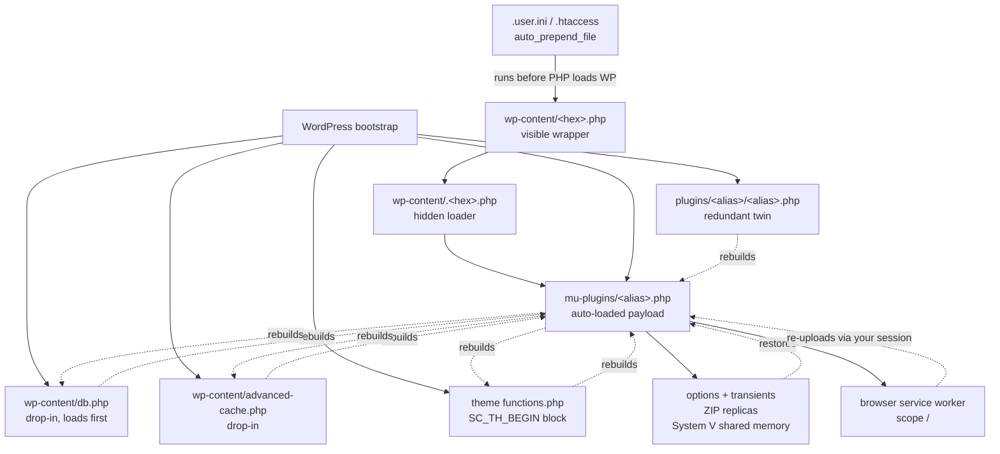
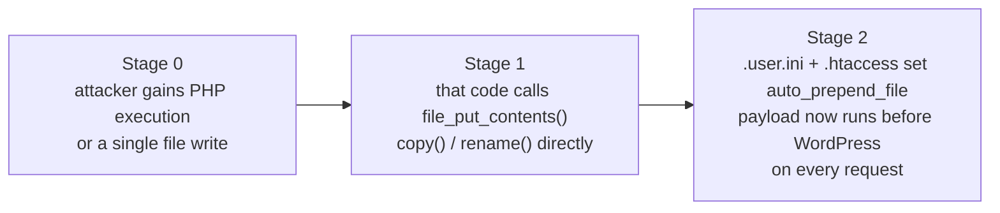

# SC 4.0.3 - self-healing WordPress malware: detection toolkit

Tools and a written procedure for the WordPress infection that rebuilds itself
seconds after you delete it - tracked as **SC 4.0.3**, and seen in the wild under
throwaway plugin names like *Trace Scanner Lite* and *trace-store-x*.

**Nothing here deletes anything.** That is on purpose, and it is the single most
important thing to understand about this malware.

> Researching *why* this works rather than how to clean it? See
> **[TECHNICAL.md](TECHNICAL.md)** - the root cause, the trust-boundary analysis,
> and why only kernel-level controls bind.

---

## Read this before you touch anything

If you think a site you run is infected right now:

1. **Do not delete files one at a time on a live site.** The implant keeps nine
   redundant copies of itself. Removing the one you can see, while the others are
   still executing, is what makes it look unkillable - the survivors rebuild it on
   the next request.
2. **Do not log in to `/wp-admin` from your normal browser.** The implant registers
   a service worker that intercepts your login POST and can re-upload the plugin
   using your own authenticated session. Every admin login hands it fresh material.
3. **Snapshot first.** Filesystem *and* database, before you change anything. Files
   are timestomped, so your own snapshot is more trustworthy evidence than any
   "Last Modified" column.

If the site belongs to a client or an institution, treat it as an incident, not a
cleanup task.

---

## What it is

A WordPress implant that steals administrator passwords in plaintext, creates a
hidden administrator, forges valid auth cookies for *every* existing administrator
with a 14-day expiry, injects content, takes remote PHP and JavaScript from a C2,
and spreads to every other WordPress install writable by the same OS user.

It resolves its C2 through **Ethereum smart contracts** - an `eth_call` with
selector `0x3bc5de30` against embedded contract addresses returns XOR-encrypted C2
URLs. There is no domain to take down.

## Why deleting it doesn't work

The infection is not a chain, it's a **mesh**. Every node can rebuild the others:



Three of those nodes are outside the filesystem entirely - the database, PHP
process memory, and *your browser*. A cleanup that only touches files cannot win.

`db.php` and `advanced-cache.php` deserve special attention: WordPress loads them
**before** must-use plugins, which is why no plugin-based security tool can reliably
defend against this.

---

## Quick start - with shell access

```bash
git clone https://github.com/ux2dev/wordpress-sc403-cleaner.git
cd wordpress-sc403-cleaner
less sc403-scan.sh          # read it before you run it. always.
./sc403-scan.sh
```

The scanner is read-only. It auto-discovers every WordPress root you can read -
which matters, because this malware spreads sideways across a hosting account, and
scanning only the site that looks sick will miss the ones reinfecting it.

```bash
./sc403-scan.sh -p /var/www/example.com    # one specific site
./sc403-scan.sh --no-db                    # skip the WP-CLI queries
./sc403-scan.sh -q                         # findings only, no "ok" lines
```

Exit codes: `0` nothing found, `1` warnings only, `2` critical findings.

### What it checks

| # | Check | Why |
|---|---|---|
| 1 | `auto_prepend_file` in `.user.ini` / `.htaccess` / `php.ini`, from the site root upwards | Pre-WordPress execution. Sever this first or everything else regenerates. |
| 2 | MU-plugin size, and the **twin-copy signature** | The same basename existing as both an MU-plugin and an ordinary plugin is the defining SC 4.0.3 layout. |
| 3 | Drop-in contents (`db.php`, `advanced-cache.php`, `object-cache.php`) | Legitimate filenames - only the contents are malicious. |
| 4 | **Six artefact names derived from `ABSPATH`** | The implant names its loader, ZIP, installer, service worker, option and theme marker as `md5(ABSPATH + role)`. The scanner computes them for your path and looks for exactly those. |
| 5 | Content markers, contract addresses | `SC_ADV_BEGIN`, `SC_DB_BEGIN`, `SC_TH_BEGIN`, `sc_payload_persistent`, `0x3bc5de30` |
| 6 | Guard stubs `.g_*.php`, hex-named PHP, PHP in `uploads/` and `cache/` | Secondary droppers. |
| 7 | ZIP archives under `wp-content` | Reinstall sources, including inside theme and upload directories. |
| 8 | Theme injection in **active and inactive** themes | Long base64 runs and `SC_TH_BEGIN` blocks. |
| 9 | Timestomp watermark (`mtime mod 100000 == 93819`) | Shared artefact of the backdating routine. |
| 10 | Known SHA-256 hashes | Eight artefacts recovered in the August 2026 analysis. |
| 11 | Database via WP-CLI: `sc_*` options, transients, `sc_cron_fetch`, oversized options | Where the payload survives file deletion. |
| 12 | **Hidden administrator diff** | Compares `wp user list` against a raw SQL join on `usermeta`. The implant filters `pre_user_query` and REST - it cannot filter `$wpdb`. |

Check 12 is the one worth knowing even if you never run this script: any admin
present in SQL but absent from the Users screen is concealment, full stop.

---

## Quick start - no shell access (cPanel / Plesk / File Manager)

You can still get a useful answer. Enable "show hidden files" in File Manager
first - several artefacts are dot-prefixed specifically to hide from you.

**Look for, in order:**

1. `.user.ini` in the document root **and** in `wp-content`. Open it. If it
   contains `auto_prepend_file`, you are infected. Check `.htaccess` in both
   places for the same directive.
2. `wp-content/mu-plugins/` - WordPress does not create this directory itself and
   most sites have nothing in it. Any PHP file over ~100 KB there is alarming.
3. `wp-content/db.php` and `wp-content/advanced-cache.php`. If you do not run a
   caching or database plugin that installed them, they should not exist. If you
   do, open them and search for `SC_DB_BEGIN` / `SC_ADV_BEGIN`.
4. Your active theme's `functions.php`. Scroll to the **bottom**. A block starting
   `SC_TH_BEGIN` or a wall of base64 means the theme is a rebuild source.
5. Any `.zip` file inside `wp-content`, `wp-content/uploads` or a theme folder.
6. Hidden files starting `.g_` anywhere, or 8-character hex names like
   `59e2e230.php` and `.59e2e230.php`.

**In wp-admin:** Users → All Users, and count administrators. Then ask your host
to run `SELECT user_login FROM wp_users` for you. If the counts differ, an account
is being hidden from you.

**Then:** contact your host. Say the words *"self-healing malware with an
`auto_prepend_file` persistence chain, please check every site under my account"*.
Hosts running Imunify360 or similar can often see it from the outside, and only
they can restart your PHP workers - which you need, because the payload also lives
in process memory.

---

## The guard mu-plugin

`sc403-guard.php` is a **tripwire for a site you believe is clean**, not a shield
for one that is infected. Copy it to `wp-content/mu-plugins/sc403-guard.php`.

It watches the four filesystem slots the implant needs, detects the hidden-admin
divergence, blocks creation of `admin_`/`adm_`/`administrator_`/`backup_` + hex
accounts, flags `sc_*` options and the `sc_cron_fetch` event, and - the part
nothing else ships - **audits your own browser for the service worker**, with a
one-click unregister button in wp-admin.

Its honest limits are written into the file's header: an MU-plugin loads *after*
`db.php`, and the payload accepts C2-supplied regexes for stripping rival code. On
an already-infected site its silence proves nothing. Use the scanner from a shell
instead.

Before deploying it, open `respond_to_detection()` and set your alerting policy -
it ships as a deliberate no-op, because "email me" and "lock wp-admin" are very
different answers depending on whose site it is.

---

## Eradication order

If the scanner comes back critical, this is the sequence. **The order is the
whole point** - every source that documents a failed cleanup failed by doing
step 3 before step 2.

1. **Contain.** Static maintenance page or take the vhost offline. Stop or restart
   the PHP-FPM pool - this is not optional: it clears the cached `.user.ini`
   (`user_ini.cache_ttl` defaults to 300 s), flushes OPcache, and destroys the
   System V shared-memory copy that survives every file you delete.
2. **Sever pre-WordPress execution.** Remove `auto_prepend_file` from every
   `.user.ini`, `.htaccess`, vhost and pool config, then the loader wrappers.
   Until this is done, every other step can be undone within one request.
3. **Remove every file node in one pass.** MU-plugin and its ordinary-plugin twin;
   `db.php` and `advanced-cache.php` (restore from the real vendor package, or
   delete if you don't use them); the `SC_TH_BEGIN` block in the theme; guard
   stubs; hex-named droppers; every ZIP replica in `wp-content`, `uploads` and
   theme directories.
4. **Clear the non-file stores.** `sc_*` options and transients, the
   `sc_cron_fetch` event, and any corrupted cron array. Export before deleting.
5. **Revoke everything.** Delete unknown administrators (verify in SQL, not the
   Users screen). Rotate every WordPress password, the salts and keys in
   `wp-config.php`, hosting and control-panel credentials, SSH/SFTP/FTP, the
   database password, deploy tokens, SMTP and API keys. Destroy all sessions
   (`wp user session destroy --all`). Forged cookies are valid for 14 days, so
   rotating salts is what actually kills them.
6. **Clean every administrator's browser.** DevTools → Application → Service
   Workers → Unregister, then clear cookies, Cache Storage and IndexedDB for the
   site. Do this on every device and profile used to administer it. **This is the
   step people skip, and it is why sites get reinfected after a perfect
   server-side cleanup.**
7. **Sweep siblings.** Every WordPress install under the same OS user is in scope
   until proven otherwise. Run the scanner across all of them.
8. **Rebuild and harden.** Core, plugins and themes from verified vendor packages -
   diff and restore only reviewed custom code. Then update (the July-August 2026
   core vulnerabilities want WordPress ≥ 7.0.4), make `mu-plugins/` non-writable by
   the web user, consider `DISALLOW_FILE_MODS` (read the note under Prevention
   first), and split unrelated sites onto
   separate OS users and PHP pools.

Only after all eight: log back in, from a cleaned browser, with a new password.

---

## How does it get in?

Worth separating clearly, because the two halves have different answers:

- **How it persists** is fully documented above and proven by the recovered code.
- **How it first arrives** is *not* determined by any of the published analysis.
  The samples prove persistence, credential theft, C2 and spread; they contain no
  reliable evidence of the original breach.

What can be said precisely is which routes are available, and that **none of them
runs through the plugin installer**. The infection arrives in two stages:



Stage 1 is the step people expect a WordPress setting to stop, and it is exactly
the step no WordPress setting touches. Once arbitrary PHP runs inside your
document root, writing a file is a language feature. The only thing that can deny
it is the operating system.

### Routes in, and whether `DISALLOW_FILE_MODS` closes them

| Route | Closed by `DISALLOW_FILE_MODS`? |
|---|---|
| Arbitrary file upload / unauthenticated file write bug in a plugin or theme | **No.** The vulnerable plugin's own code does the writing. |
| Supply-chain backdoored plugin (the Seven Labs case: `sp-news-and-widget`, `content-sync-helper`, `advanced-product-maker-data`, `wordpesso`) | **No.** It arrives inside a plugin you installed on purpose. |
| RCE, PHP object injection or deserialisation bug in a plugin, theme or core | **No.** |
| Stolen SFTP / FTP / SSH / control-panel credentials | **No.** Never touches WordPress at all. |
| Lateral spread from a sibling site under the same OS user | **No.** A *different* site's PHP process writes into your document root. Your `wp-config.php` is never consulted. |
| Compromised developer machine or deploy pipeline | **No.** |
| Leftover webshell, or unrelated vulnerable app in the same docroot | **No.** |
| Stolen administrator password used to upload a backdoor plugin via wp-admin | **Yes.** |
| The service worker re-uploading the payload through the plugin-upload route | **Yes.** |

Two of nine, and both of those are the ones that go through wp-admin's uploader.

### Why Stage 2 works

`auto_prepend_file` is an `INI_PERDIR` directive, so it can be set from a
per-directory file without any server access:

- Under **PHP-FPM / CGI / FastCGI**, from `.user.ini`. Per the PHP manual, these
  files are *"processed only by the CGI/FastCGI SAPI"*.
- Under **mod_php**, `.user.ini` is ignored entirely and `.htaccess` is used
  instead - which is why the malware drops both and why checking only one is a
  common miss.

From that point the payload executes before PHP reaches `wp-config.php`, so every
WordPress-level control - constants, plugins, security suites - is downstream of
it and can be filtered by it.

### The two questions that actually decide your exposure

Exposure is not one question, it is two, and they are enforced at different
layers. Conflating them is why people set `DISALLOW_FILE_MODS` and think they are
done.

**1. Can an attacker get code running in my document root at all?**
This is the *arrival* question, and no single setting answers it - it is the sum of
patching, plugin provenance, credential hygiene, and not sharing an OS user with a
site you do not control. It is also the only stage that leaves external evidence
(see [TECHNICAL.md](TECHNICAL.md#stage-0-where-the-first-byte-actually-comes-from)),
so it is where detection is possible but prevention is never total. Assume it will
eventually be answered "yes" on a long enough timeline.

**2. If they do, does that become *permanent*?**
This is the *persistence* question, and here there is a single decisive test:

> **Can the PHP worker's UID write to my code directories?**

If yes, any code execution ends in a self-healing implant - the whole mesh in this
document. If no, an attacker with code execution is confined to the directories
that must stay writable, normally just `uploads/`, and then still needs a way to
get that file *executed*, which is what denying PHP execution in `uploads/` removes.

The reason to obsess over question 2 rather than question 1: question 1 you can
only ever reduce, but question 2 you can actually *close*, and closing it downgrades
every "yes" to question 1 from a permanent compromise to a contained incident. That
is the whole game - you cannot stop every break-in, so you make a break-in unable to
become a resident.

## Prevention

The cheap measures, roughly in order of how much they buy you:

- **Separate OS users and PHP-FPM pools per site.** This one change turns an
  account-wide compromise into a single-site one. It defeats the lateral spread
  entirely.
- **Make `wp-content/mu-plugins/` and the drop-in slots non-writable** by the web
  server user. The implant's preferred home becomes unavailable.
- **`define( 'DISALLOW_FILE_MODS', true );`** - but understand what it does and
  does not do, because it is widely oversold. See the note below.
- **Update.** Core ≥ 7.0.4, and *every* plugin and theme including deactivated
  ones - an inactive plugin's files are still on disk and still reachable.
- **Delete unused plugins and themes** rather than deactivating them.
- **Only install plugins from sources you can vouch for.** The Seven Labs case
  traced entry to plugins sourced outside the official repository.
- **Disable PHP execution in `wp-content/uploads/`.** Uploads must stay writable,
  which makes it the landing zone for a file-write bug. Denying execution there
  turns a dropped payload into an inert file.
- **Install `sc403-guard.php`** while the site is clean, so the baseline it
  captures is a clean one.

### Will `chmod` save the site?

Only if you fix ownership at the same time. On a default shared-hosting setup,
`chmod` on its own does not save you, and the malware is documented working
around it.

The trap is that **`chmod()` requires ownership, not write permission.** On most
cPanel/Plesk hosts and any per-user PHP-FPM pool, PHP runs as *the same user that
owns the files*. So a payload that finds `mu-plugins/` set to `0555` simply calls
`chmod()` on it, writes, and sets it back. The recovered SC 4.0.3 sample does
exactly this - its MU copy was found at mode `0444`, and the analysis notes the
payload "can change permissions when it needs to replace a file and set them back
afterward". Read-only mode bits are an obstacle to *you*, not to it.

`chmod` becomes a real control only when the PHP user **is not the owner**:

```
# files owned by a deploy/admin user, PHP runs as someone else
chown -R deploy:www-data /var/www/site
find /var/www/site -type d -exec chmod 755 {} +   # no group/other write
find /var/www/site -type f -exec chmod 644 {} +
# uploads is the exception - it has to stay writable
chown -R deploy:www-data /var/www/site/wp-content/uploads
find /var/www/site/wp-content/uploads -type d -exec chmod 775 {} +
```

Now `www-data` cannot write to the code directories and cannot `chmod` them back,
because it owns nothing. That is enforced by the kernel.

**The decisive test** - run this rather than trusting the mode bits:

```
sudo -u "$(ps -o user= -C php-fpm | sort -u | grep -v root | head -1)" \
     touch /path/to/site/wp-content/mu-plugins/.writetest && echo "STILL WRITABLE"
```

If that prints `STILL WRITABLE`, permissions have not saved the site. Remove the
test file afterwards.

Two caveats:

- **`uploads/` must stay writable**, so it stays a landing zone. Pair this with
  denying PHP execution there - otherwise you have made the payload harder to
  install and no harder to run.
- **This breaks in-dashboard updates**, the same trade-off as `DISALLOW_FILE_MODS`.
  It suits sites deployed from a pipeline. If a site self-updates, you are choosing
  between two exposures, so choose deliberately.

`chattr +i` on individual files is stronger still - not even the owner can write
until the flag is cleared, which needs `CAP_LINUX_IMMUTABLE` - but it is
Linux-filesystem-specific and will break every update until you remember it is
there.

### Does `DISALLOW_FILE_MODS` stop this attack?

No. It is worth setting on some sites, but not for the reason people assume.

The constant feeds exactly one function, `wp_is_file_mod_allowed()` in
`wp-includes/load.php`, which `map_meta_cap()` uses to revoke a fixed set of
capabilities: `edit_files`, `edit_plugins`, `edit_themes`, `install_plugins`,
`upload_plugins`, `update_plugins`, `delete_plugins`, the four matching theme
capabilities, `update_core`, and the language-pack capabilities.

That is a permission check on WordPress's own admin routes. It has no bearing on
what arbitrary PHP can do. SC 4.0.3 writes its replicas with `file_put_contents()`,
`copy()` and `rename()`, and it reaches the filesystem through `auto_prepend_file`
and the `db.php` drop-in - it never asks WordPress for permission, so there is
nothing for this constant to deny. Every persistence node survives it.

**What it genuinely closes:** the browser service worker reinstalls the payload by
driving WordPress's own plugin-upload route with the administrator's session and a
scraped `_wpnonce`. That route needs `upload_plugins`, so the constant breaks it.
It also blocks the classic "stolen admin password to backdoor plugin" entry path.
Two real doors, both worth shutting.

**The cost, which is not small:** `WP_Automatic_Updater::is_disabled()` calls the
same function, so this also turns off *all* background updates, including core
security releases. On a site nobody actively maintains, that trade is usually a
net loss - you close two doors and stop patching the ones you have not found yet.

**The control that actually constrains the malware** is at the OS layer, not in
`wp-config.php`: make the code directories unwritable by the PHP user, and give
each site its own OS user and PHP-FPM pool. Those are enforced by the kernel,
which is not something a compromised PHP process can filter.

So: set it on sites you patch by hand or through a deployment pipeline. Do not set
it and consider the problem handled, and do not set it on a site whose only
patching is WordPress auto-updates.

---

## Indicators of compromise

Machine-readable, with confidence ratings and provenance: **[`iocs.csv`](iocs.csv)**.

The highest-value strings to grep for:

```
SC_ADV_BEGIN   SC_DB_BEGIN   SC_TH_BEGIN
sc_payload_persistent   sc_persist_manifest   sc_cron_fetch
0x3bc5de30     auto_prepend_file
```

Two cautions that matter more than the list itself:

- **Plugin names are camouflage.** *Trace Scanner Lite* is one observed alias with
  a fake header claiming v1.1.0. Hunt behaviour, markers and hashes - not names.
- **Hex filenames from someone else's site are not a deletion list.** They are
  `md5(ABSPATH + role)`, so they differ per install. Legitimate plugins also store
  large values under generated names. Validate contents before removing anything.

Found a new alias, hash or contract address? Open an issue or a PR against
`iocs.csv` - the alias list is meant to grow.

---

## What this is not

- Not a remover. By design.
- Not proof of cleanliness. A clean scan means these indicators were absent, which
  is not the same as the site being clean - the family evolves and names change.
- Not an initial-access diagnosis. The recovered samples prove persistence,
  credential theft and spread; they do not reveal how the first site was breached.
  To find that, correlate backups against raw HTTP, WAF, control-panel and
  SFTP/SSH logs - never against file timestamps, which are deliberately falsified.
- Not a substitute for professional incident response on a site that matters.

## Sources

- MD Pabel - [SC 4.0.3 Self-Healing WordPress Malware That Rebuilds Itself](https://www.mdpabel.com/malware-research/sc-403-self-healing-wordpress-malware/) (22 Aug 2026) - the deepest technical analysis; hashes, ABSPATH formulas and the option table come from here.
- Monarx - [The WordPress Infection That Rebuilds Itself Faster Than You Can Delete It](https://www.monarx.com/press-news/the-wordpress-infection-that-rebuilds-itself-faster-than-you-can-delete-it) - the nine-mechanism mesh, the timestamp watermark, the service-worker behaviour.
- Seven Labs - [WordPress malware removal case study: edu.gov.sc](https://www.sevenlabs.site/case-studies/wordpress-malware-removal-edu-gov-sc) - a real six-phase remediation, plus the supply-chain entry plugins.
- Jump.BG - [WordPress SC-403 self-healing malware](https://www.jump.bg/blog/wordpress-sc-403-self-healing-malware) - hosting-side view and prevention.

## License

GPL-2.0-or-later. Use it, fork it, ship it to your clients.
